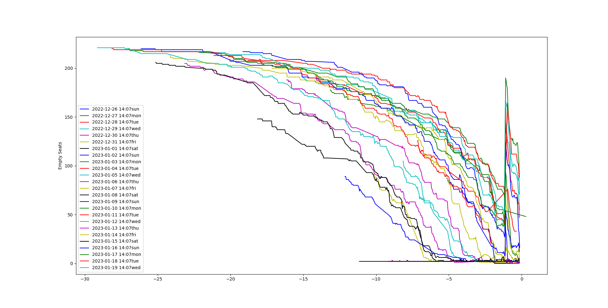
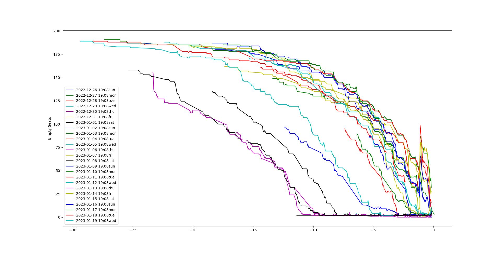

# Train Trip Data Project

## Aim
Creating data for observing available train tickets over one half month to catch their sale patterns. Finding best intervals to buy tickets.

## Method
Scraping train ticket website by using Selenium framework on python.

Scraping process is running twice in a hour, in each process it scrapes available tickets for observing extinction of tickets.

Using chromedriver as webdriver with Chrome.

Holding data in MySQL data warehouse.

## Simple Review Of Collected Data

