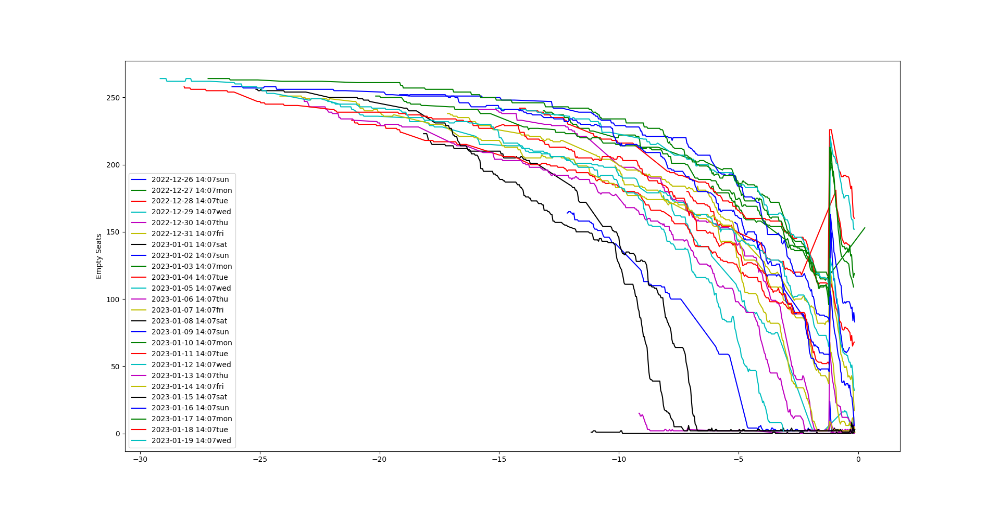
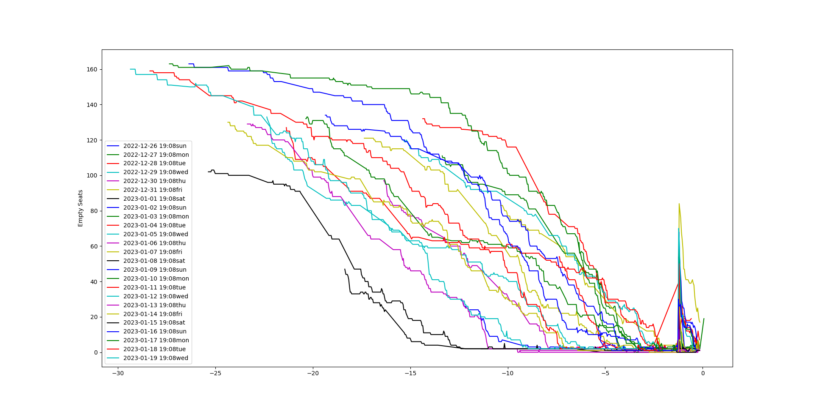

# Train Trip Data Project

## Aim
Creating data for observing available train tickets over one half month to catch their sale patterns. Finding best intervals to buy tickets.

## Method
Scraping train ticket website by using Selenium framework on python.

Scraping process is running twice in a hour, in each process it scrapes available tickets for observing extinction of tickets.

Using chromedriver as webdriver with Chrome.

Holding data in MySQL data warehouse.

## Some Insights From Collected Data

Relying on data visualizations below:
- Saturday is the most demanding day and tickets are consumpted 7 days before the trip date.
- A serious amount of ticket returns happening on the day before the trip. 
- When there is a low demand to cancelled trip, returns create significant increment in empty seats.
- When there is a high demand to cancelled trip, returns are less and repurchases happen immediately, and there is no a pulse in the high demanding trips.
-  Buy the ticket at least 5 days ago for an average day to travel without risk of being out of tickets.

